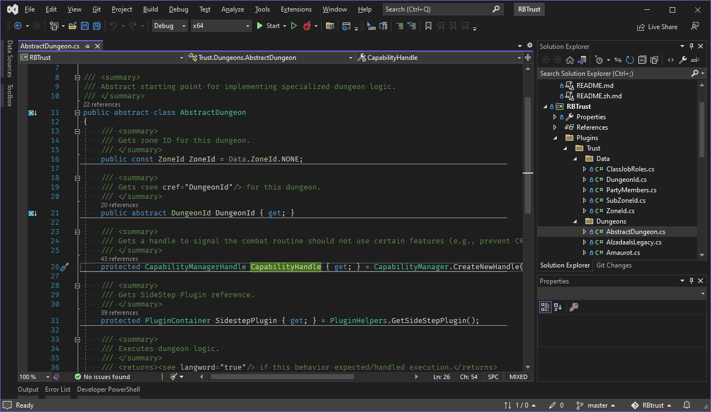
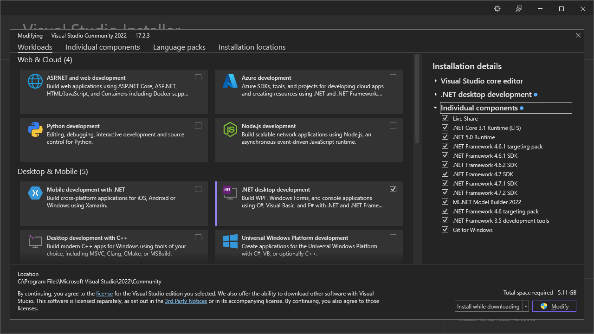

# Configuring Your Development Environment

Good development tools are a huge leap in quality-of-life over playing with Microsoft Notepad. This page covers setting up a proper development environment so you can focus on making cool things instead of fighting your editor.

You may already be comfortable with your own setup and that's okay. The important thing to know is most RebornBuddy development involves .NET Framework 4.8, C#, WinForms, XML, JSON, and maybe WPF. Source control and project distribution are done with `git` and GitHub.

Furthermore, this site can't cover all programming and tooling topics -- consider it a primer. It's expected and essential to search online and ask questions in [#rb-bootcamp][wiki-discord].

## Visual Studio Community Edition



**Visual Studio Community Edition** is a free "Integrated Development Environment" (IDE), which is big talk for a fancy text editor aimed at programmers. It helps you write code easier thanks to auto-complete, syntax highlighting, error checking, auto-formatting, etc.

### Installing Visual Studio

Download and run the [installer][vs-installer]. Continue until you reach the ++"Workloads"++ screen.

!!! question "Already installed Visual Studio?"

    Run ++"Visual Studio Installer"++ from the Windows Start Menu and click ++"Modify"++ to find the same screen.



Install the following options from each tab:

-   **Workloads:**
    -   .NET Desktop Development
-   **Individual Components:**
    -   **.NET:**
        -   .NET 5.x-6.x Runtimes
        -   .NET Core 3.1 Runtime
        -   .NET Framework 3.5 Development Tools
        -   .NET Framework 4.6-4.8.x Targeting Packs
        -   .NET Framework 4.6-4.8.x SDKs
    -   **Code Tools:**
        -   Git for Windows

[vs-installer]: https://visualstudio.microsoft.com/vs/community/

### Configuring Visual Studio

Below are some common settings worth changing:

-   **Color Theme:** ++"Tools"++ > ++"Options"++ > ++"Environment"++ > ++"Color Theme"++: (Blue|Dark|Light|System)
-   **Line Numbers:** ++"Tools"++ > ++"Options"++ > ++"Text Editors"++ > ++"All Languages"++ > check ++"Line Numbers"++ (may start as a square; click until checked)


### Extensions for Visual Studio

Install the following extensions by opening each link and clicking ++"Download"++:

-   [Code Cleanup on Save](https://marketplace.visualstudio.com/items?itemName=MadsKristensen.CodeCleanupOnSave) - Auto format and code cleanup on save. Enable it in ++"Tools"++ > ++"Options"++ > ++"Environment"++ > ++"Code Cleanup on Save"++.
-   [Markdown Editor v2](https://marketplace.visualstudio.com/items?itemName=MadsKristensen.MarkdownEditor2) - Live preview while editing Markdown (`.md`) documents.
-   [Visual Studio Spell Checker](https://marketplace.visualstudio.com/items?itemName=EWoodruff.VisualStudioSpellCheckerVS2022andLater) - Spell check in comments, strings, etc.

## Visual Studio Code

**Visual Studio Code** is a general purpose text editor. It's lighter weight than "real" Visual Studio and can be extended with plugins, so it's useful for editing text files like `.md` and `.xml`, or using programming languages not supported by Visual Studio.

### Installing Visual Studio Code

[Download][vscode-installer] and install Visual Studio Code.

[vscode-installer]: https://code.visualstudio.com/download

### Extensions for Visual Studio Code

Install the following extensions:

-   [C# for VS Code](https://marketplace.visualstudio.com/items?itemName=ms-dotnettools.csharp) - C# language support and auto-formatting.
-   [EditorConfig for VS Code](https://marketplace.visualstudio.com/items?itemName=EditorConfig.EditorConfig) - Auto-format according to the project's `.editorconfig` rules-file.
-   [GitHub Markdown Preview Pack](https://marketplace.visualstudio.com/items?itemName=bierner.github-markdown-preview) - Properly preview GitHub-flavored Markdown.
-   [Indent Rainbow](https://marketplace.visualstudio.com/items?itemName=oderwat.indent-rainbow) - Colorize indentation by depth. Helps spot related code.
-   [Spell Checker](https://marketplace.visualstudio.com/items?itemName=streetsidesoftware.code-spell-checker) - Stop misspelling your code and comments!
-   [XML Tools](https://marketplace.visualstudio.com/items?itemName=DotJoshJohnson.xml) - Useful XML helpers, especially auto-formatting.

### Configuring Visual Studio Code

In Visual Studio Code, press ++ctrl+shift+p++, type `settings.json`, then choose "Preferences: Open Settings (JSON)". Replace with the following:

```json
{
    "editor.bracketPairColorization.enabled": true,
    "editor.guides.bracketPairs": "active",
    "editor.fontFamily": "'Fira Code', Consolas, 'Courier New', monospace",
    "editor.fontLigatures": true,
    "editor.formatOnPaste": true,
    "editor.formatOnSave": true,
    "editor.renderLineHighlight": "all",
    "editor.renderWhitespace": "all",
    "files.eol": "\n",
    "files.insertFinalNewline": true,
    "files.trimFinalNewlines": true,
    "files.trimTrailingWhitespace": true,
    "workbench.colorTheme": "Visual Studio Dark",
    "workbench.iconTheme": "vs-seti",
    "workbench.startupEditor": "none",
    "[csharp]": {
        "editor.defaultFormatter": "ms-dotnettools.csharp"
    },
    "[xml]": {
        "editor.tabSize": 2,
        "editor.defaultFormatter": "DotJoshJohnson.xml"
    }
}
```

## WinMerge

[**WinMerge**][winmerge] is a "diff-tool" that helps compare different versions of a file and combine them into a final merged version. This is useful for figuring out what's changed in a file, or resolving multiple people editing the same file simultaneously.

[winmerge]: https://winmerge.org/

### Installing WinMerge

Download and run the [WinMerge Installer][winmerge-installer]. Check ++"Add WinMerge folder to your system path"++ during the last step before installing:


[winmerge-installer]: https://winmerge.org/downloads/?lang=en

### Configuring WinMerge

In WinMerge, open ++"Edit"++ > ++"Options..."++ > ++"Backup Files"++. Uncheck all "Create backup files in:" options to avoid `.bak` files being created when merging files.


## `git` Source Control

`git` is source control software -- it helps us organize source code, compare and combine different versions of the same files, and collaborate with other developers a lot easier. No more guessing what you changed or which copy is newer; significantly less hassle incorporating the work of others; and no more disorganized manual backups. You can even rewind to older versions if a new change didn't work out!

### Using `git`

Learning `git` [can take a bit][ry-git], but the fundamental ideas are:

-   Source code is stored in a **repository**, which contains the complete history every change to every file.
-   Each change is called a **commit**, which represents a distinct version of the code. Commits include the exact details of how each file changed and a small patch note written by the developer.
-   Repositories can be rewound or fast forwarded to any commit, allowing developers to retrieve any version of the program or undo bad changes. It's like time travel!
-   Repositories can also be **branched** for development in a separate copy of the code. This is great for isolating big or experimental features until they're ready to be **merged** back to the main branch.
-   Everyone gets their own copy of the repository that can be synced by a series of **pushes** and **pulls**. Luckily, `git` is really good at auto-merging different people's work, but may ask you for help getting it right in tricky situations.

In practice, the main commands/workflow to know:

-   `git init` to start a project.
-   `git add .` + `git commit` to submit changes.
-   `git push` + `git pull` to trade changes with others.

Check out [Ry's `git` Tutorial][ry-git] and search the internet for more articles and videos to learn from.

[ry-git]: https://johnmathews.is/rys-git-tutorial.html

### Installing `git`

Git for Windows was installed alongside Visual Studio, but can be [installed separately][git-installer] if needed.

If installing yourself, enable the following options:

-   Windows Explorer Integration: Git Bash Here
-   Git LFS (Large File Support)

[git-installer]: https://git-scm.com/download

### Configuring `git`

Open ++"Git Bash"++ from the Windows Start Menu and run the follow commands:

Manually edit these lines to set the commit author details:

```bash
# Commit author details; these are required AND public!
# Use an email attached to your GitHub account for credit.
# Can also use UserName@users.noreply.github.com for privacy.
git config --global user.name "Your Name"
git config --global user.email "your.email@example.com"
```

Copy/paste this entire block; no modification needed:

```bash
# Tool Integrations
git config --global merge.tool "winmerge"
git config --replace --global mergetool.winmerge.cmd "WinMergeU.exe -e -u -o \"\$MERGED\" -dl \"Local\" -dm \"Base\" -dr \"Remote\" \"\$LOCAL\" \"\$BASE\" \"\$REMOTE\""
git config --global mergetool.prompt "false"

git config --global diff.tool "winmerge"
git config --replace --global difftool.winmerge.cmd "WinMergeU.exe -e -u -dl \"Old\" -dr \"New\" \"\$LOCAL\" \"\$REMOTE\""
git config --global difftool.prompt "false"

git config --global gpg.program "$(where gpg)"

# Usability
git config --global push.default "simple"
git config --global push.followTags "true"

git config --global status.showUntrackedFiles "all"
git config --global core.autocrlf "true"
git config --global color.ui "true"

# Aliases/Shortcuts/Macros
git config --global alias.hist "log --graph --pretty=format:'%Cred%h%Creset -%C(yellow)%d%Creset %s %Cgreen(%cr) %C(bold blue)<%an>%Creset'"
git config --global alias.stash-all "stash save --include-untracked"
```

## GitHub

[**GitHub**][github] is a popular website that hosts `git` repositories (source code) and helps developers collaborate on projects. It has free public and private repositories, good documentation, issue tracking, automatic build servers, download distribution, and more. All this makes it a good choice of host for new projects.

[github]: https://github.com/

### Signing Up for GitHub

[Register at GitHub.com][github-join] -- the free account is enough.

Choose a good, safe-for-work username. It's painful to change later because it breaks all existing links to your repositories, among other troubles.

Use a good password and STRONGLY consider [enabling TOTP two-factor authentication][github-2fa]. Compromised developer accounts are gold; don't wait until it's too late. Use [LastPass][lastpass] _alongside_ [Authy][authy] or [LastPass Authenticator][lastpass-authenticator] if you lack a password or 2FA manager.

[github-join]: https://github.com/join
[github-2fa]: https://help.github.com/en/articles/configuring-two-factor-authentication#configuring-two-factor-authentication-using-a-totp-mobile-app
[lastpass]: https://www.lastpass.com/
[lastpass-authenticator]: https://lastpass.com/auth/
[authy]: https://authy.com/download/

## What's Next?

Now that you have the tools, it's time to learn how to use them:

-   Don't know C#? Consider [the Yellow Book][c#-yellow-book], or find other tutorials to your taste.
-   Haven't used `git`? See [Ry's `git` Tutorial][ry-git] to start versioning and collaborating on code.
-   New to GitHub? `git` and GitHub aren't the same thing -- [learn more here][github-tutorial].

And after learning the basics of each, you're finally ready to create RebornBuddy add-ons.

[c#-yellow-book]: https://www.robmiles.com/c-yellow-book
[github-tutorial]: https://skills.github.com/
